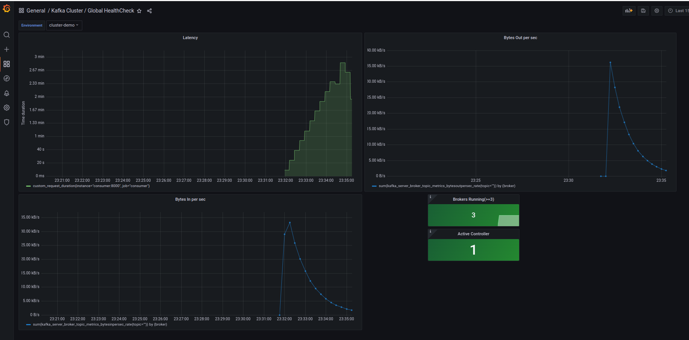

# data_streaming

Collaborators:
 - Vadym Popyk
 - Oleksii Zarembovskyi
 - Daria But

1. We have chosen the Twitter dataset from [Kaggle](https://www.kaggle.com/datasets/crowdflower/twitter-airline-sentiment).

2. Here is our kafka environment with 3 brokers - [docker-compose.yml](https://github.com/ctrldash/data_streaming/blob/349f10d9c5feaebb7ccf10299e0f87d4b0ac66b3/docker-compose.yml).

3. Implemented message [generator microservice](https://github.com/ctrldash/data_streaming/blob/349f10d9c5feaebb7ccf10299e0f87d4b0ac66b3/message_generator).

4. Implemented [consumer microservice](https://github.com/ctrldash/data_streaming/blob/349f10d9c5feaebb7ccf10299e0f87d4b0ac66b3/consumer) 
(with 0.1 sec sleep to imitate processing).

5. We have used prometheus + grafana to generate a report with metrics.

6. Experiments with different configuration of producers, consumers and topics:

- One producer, a topic with one partition, one consumer:

- One producer, a topic with one partition, 2 consumers.
It doesn't affect performance as redundant consumers over partitions are not used.

- One producer, a topic with 2 partitions, 2 consumers

- One producer, a topic with 5 partitions, 5 consumers

- One producer, a topic with 10 partitions, 1 consumers
It doesn't affect performance as one consumer reads all consumers.

- One producer, a topic with 10 partitions, 5 consumers

- One producer, a topic with 10 partitions, 10 consumers

- 2 producers (input data should be split into 2 parts somehow), a topic with 10 partitions, 10 consumers

