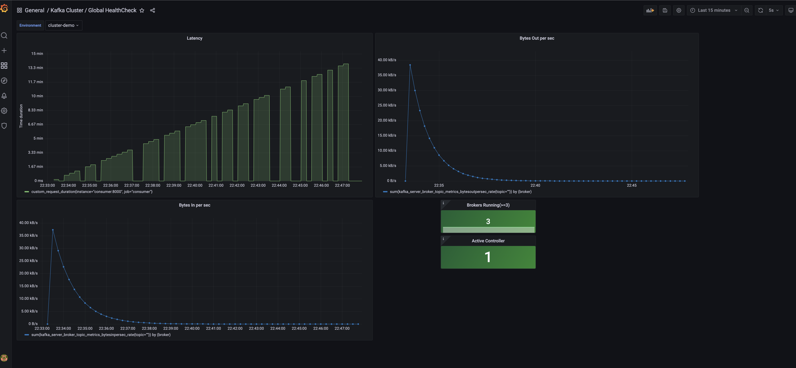

# data_streaming

Collaborators:
 - Vadym
 - Oleksii
 - Daria

Experiments with different configuration of producers, consumers and topics:

One producer, a topic with one partition, one consumer:

One producer, a topic with one partition, 2 consumers

One producer, a topic with 2 partitions, 2 consumers

One producer, a topic with 5 partitions, 5 consumers

One producer, a topic with 10 partitions, 1 consumers

One producer, a topic with 10 partitions, 5 consumers

One producer, a topic with 10 partitions, 10 consumers

2 producers (input data should be split into 2 parts somehow), a topic with 10 partitions, 10 consumers